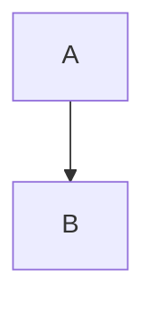

# GitHub Actions入门

## 一、What

CI/CD包含很多操作（拉代码，跑测试，登录远程服务器等），Github把这些操作称为actions，

由于很多操作很多操作在不同项目里面是类似的，完全可以共享。GitHub 注意到了这一点，想出了一个很妙的点子，允许开发者把每个操作写成独立的脚本文件，存放到代码仓库，使得其他开发者可以引用。

如果你需要某个 action，不必自己写复杂的脚本，直接引用他人写好的 action 即可，整个持续集成过程，就变成了一个 actions 的组合。这就是 GitHub Actions 最特别的地方。

GitHub 做了一个[官方市场](https://github.com/marketplace?type=actions)，可以搜索到他人提交的 actions。另外，还有一个 [awesome actions](https://github.com/sdras/awesome-actions) 的仓库，也可以找到不少 action。

上面说了，每个 action 就是一个独立脚本，因此可以做成代码仓库，使用`userName/repoName`的语法引用 action。比如，`actions/setup-node`就表示`github.com/actions/setup-node`这个[仓库](https://github.com/actions/setup-node)，它代表一个 action，作用是安装 Node.js。事实上，GitHub 官方的 actions 都放在 [github.com/actions](https://github.com/actions) 里面。

既然 actions 是代码仓库，当然就有版本的概念，用户可以引用某个具体版本的 action。下面都是合法的 action 引用，用的就是 Git 的指针概念，详见[官方文档](https://help.github.com/en/articles/about-actions#versioning-your-action)。

```shell
actions/setup-node@74bc508 # 指向一个 commit
actions/setup-node@v1.0    # 指向一个标签
actions/setup-node@master  # 指向一个分支
```

## 二、How

### 基本概念

1. **workflow** （工作流程）：持续集成一次运行的过程，就是一个 workflow。

2. **job** （任务）：一个 workflow 由一个或多个 jobs 构成，含义是一次持续集成的运行，可以完成多个任务。

3. **step**（步骤）：每个 job 由多个 step 构成，一步步完成。

4. **action** （动作）：每个 step 可以依次执行一个或多个命令（action）。

### workflow文件


数学公式测试$\frac{x_{2}}{x_1}$

画图测试



## 参考链接

> 1. [GitHub Actions 入门教程 - 阮一峰的网络日志 (ruanyifeng.com)](https://www.ruanyifeng.com/blog/2019/09/getting-started-with-github-actions.html)
